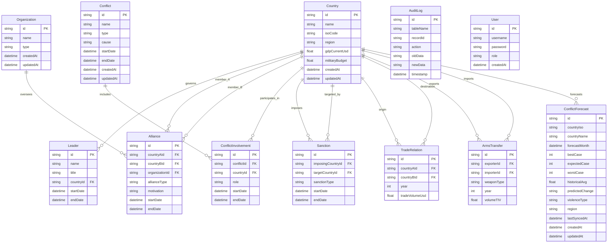

# GGICAS Database ERD

This document contains the Entity-Relationship Diagram (ERD) representing the full database structure of the Geopolitical Intelligence & Conflict Analysis System.

## Entity-Relationship Diagram

## Key Architectural Decisions

1.  **Junction Tables**: `ConflictInvolvement`, `Alliance`, `Sanction`, `TradeRelation`, and `ArmsTransfer` act as junction tables that facilitate Many-to-Many relationships between Countries or between Countries and Conflicts/Organizations.
2.  **Self-Referencing Relationships**: The `Alliance`, `Sanction`, `TradeRelation`, and `ArmsTransfer` tables utilize two Foreign Keys pointing back to the `Country` table to represent directional or reciprocal interactions between two nations.
3.  **Auditability**: The `AuditLog` table is a standalone entity that tracks changes across the entire system through database triggers, rather than having direct foreign key relationships, ensuring high performance.
4.  **Forecasting**: The `ConflictForecast` table is optimized for time-series and regional analysis, including unique constraints on country, time, and event type.
5.  **Optimized Retrieval (Cursors)**: The system utilizes Keyset Pagination (Cursors) for $O(log n)$ retrieval of large datasets, bypassing the performance bottlenecks of traditional `OFFSET` pagination.
6.  **Encapsulated Logic (Stored Procedures)**: Complex, multi-step business operations (such as Leader Succession) are encapsulated in atomic "Stored Procedure" patterns to guarantee data consistency across multiple entities.
